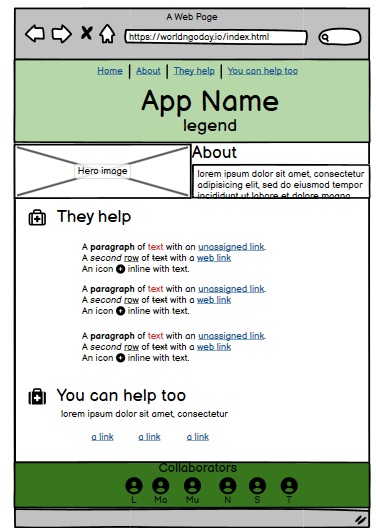
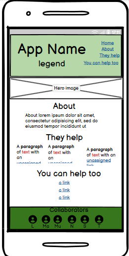

#WorldNgoDay

In preparation for World NGO Day, our app pays tribute to some of the many organizations that are helping and comforting the victims of the recent earthquakes in Turkey and Syria.

The human and economic efforts of these organizations leave a positive impact on the lives of those who are somehow involved with them.

This app (to be replaced with the name of the site) adds to that effort by presenting the user with an overview of the contribution of NGOs in daily life, it focuses on the aid currently being provided in Turkey and Syria and leaves the user the opportunity to join that help through donations.
The NGOs present in our application were chosen at random and with the sole purpose of celebrating their global impact in a general way.

Let's celebrate supporting NGOs!

Visit the live [website](https://muzhdan.github.io/WorldNgoDay/) in here

<--! ADD IMAGE OF THE RESPONSIVE APP ASAP -->

## **Design**

### **Wireframes**
### **Desktop**

#### **Mobile**

--- 

## **Technologies**
- Balsamiq: Wireframes were created using [Balsamiq Wireframes for Desktop ](https://balsamiq.com/wireframes/desktop/)
- Bootstrap: Part of the styling of our application was made using Bootstrap 5.2.3 [Bootstrap](https://getbootstrap.com/)

## **Credits**
- The explanation about the way the donations are used comes from the websites of the NGOs presented in our application.
- General knowledge about NGOs comes from [Wikipedia](https://en.wikipedia.org/wiki/Non-governmental_organization) and the official #NGO World Day website [NGO World Day](https://worldngoday.org/).
- Logo for the head was taken from [flaticon](https://www.flaticon.com/search?word=help)
